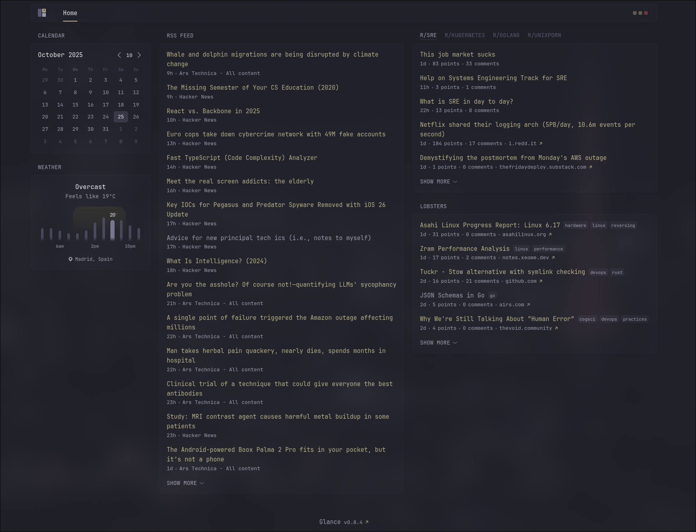
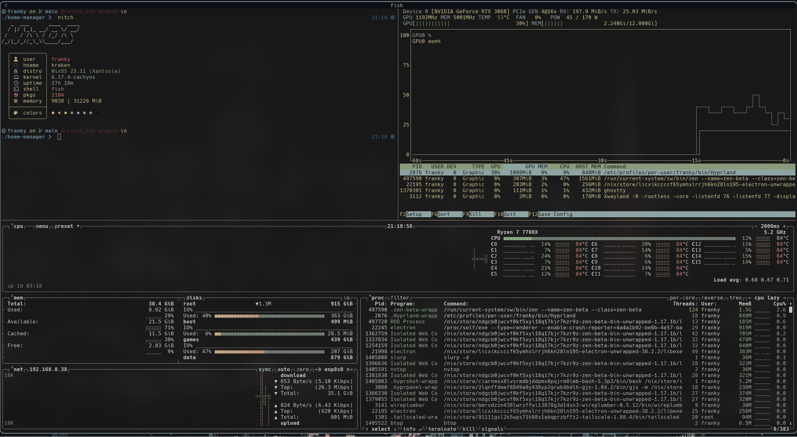
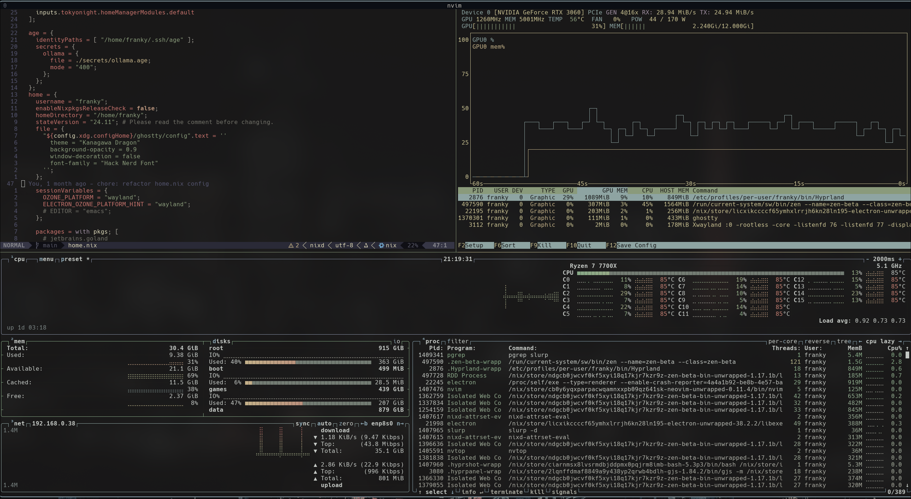
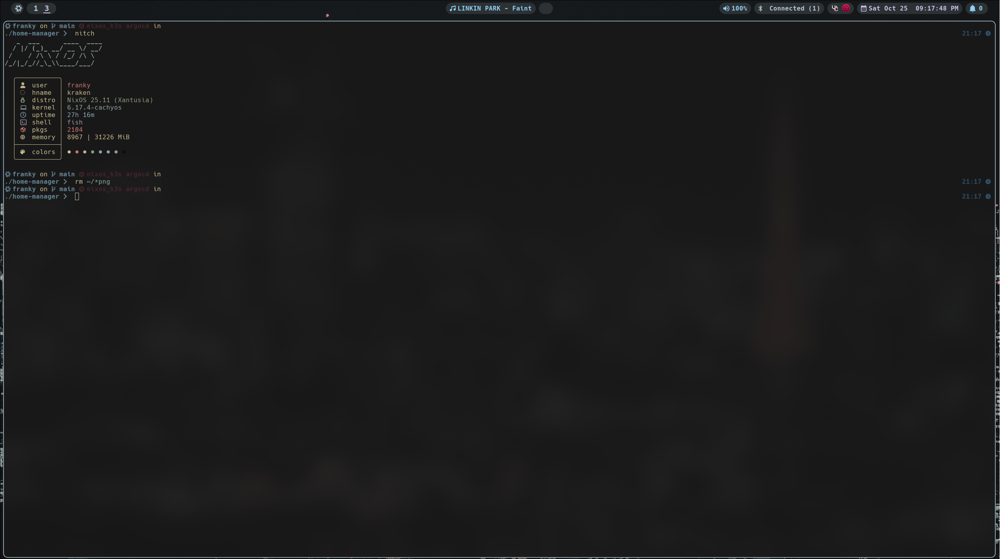

# NixOS dotfiles
This repo contains the nix configurations for my main workstations
## How does the config looks like






## Structure

Under hosts I have the hardware and basic config of each of my hosts, these are divided by their hostname.
```
.
├── assets
│   ├── glance.png
│   ├── nitch_full_screen.png
│   ├── tmux_btop.png
│   └── tmux_nvim.png
├── devtooling
│   ├── default.nix
│   ├── git
│   │   └── default.nix
│   ├── gleam
│   │   └── default.nix
│   ├── go
│   │   └── default.nix
│   ├── kubernetes
│   │   ├── default.nix
│   │   └── skin.yml
│   ├── lua
│   │   └── default.nix
│   ├── rust
│   │   └── default.nix
│   ├── tmux
│   │   └── default.nix
│   └── zed
│       └── default.nix
├── flake.lock
├── flake.nix
├── gtk
│   ├── conf
│   │   └── default.nix
│   └── default.nix
├── home.nix
├── hosts
│   ├── franktory
│   │   └── etc
│   │       └── nixos
│   │           ├── configuration.nix
│   │           └── hardware-configuration.nix
│   └── kraken
│       └── etc
│           └── nixos
│               ├── configuration.nix
│               ├── glance.nix
│               ├── hardware-configuration.nix
│               ├── logiops.nix
│               ├── ollama.nix
│               └── udev.nix
├── hyprland
│   ├── config
│   │   ├── animations.nix
│   │   ├── bindings.nix
│   │   └── windowrules.nix
│   ├── default.nix
│   ├── hypr.nix
│   ├── hyprlock.nix
│   ├── hyprpanel.nix
│   ├── hyprpaper.nix
│   └── wlogout.nix
├── packages.nix
├── prompt
│   ├── default.nix
│   └── starship
│       ├── default.nix
│       ├── kanagawa.nix
│       ├── oxocarbon.nix
│       ├── oxo.toml
│       └── tokyonight.nix
├── README.md
├── secrets
│   ├── ollama.age
│   └── secrets.nix
├── shelltools
│   ├── atuin
│   │   └── default.nix
│   ├── bat
│   │   └── default.nix
│   ├── default.nix
│   ├── direnv
│   │   └── default.nix
│   ├── eza
│   │   └── default.nix
│   ├── fish
│   │   └── default.nix
│   ├── fzf
│   │   └── default.nix
│   ├── yazi
│   │   └── default.nix
│   ├── zoxide
│   │   └── default.nix
│   └── zsh
│       └── default.nix
├── stylix
│   └── default.nix
├── terminals
│   ├── default.nix
│   └── kitty.nix
├── treefmt.toml
└── .gitignore
```
